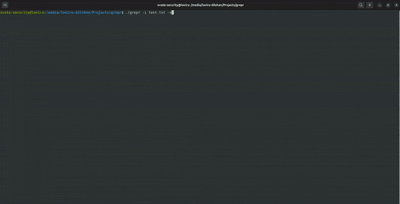

# 🕵️‍♂️ Grepr

Grepr is a blazing-fast, lightweight CLI tool designed for **URL filtering and recon**, built specifically for **bug bounty hunters**, **penetration testers**, and **automation workflows**. Inspired by the simplicity of `grep`, Grepr adds targeted intelligence to filter URLs by **file type**, **regex patterns**, or **super mode automation**.

<p align="center">
  
</p>

---

## ✨ Features

- 🎯 Filter URLs by file types (e.g., `.js`, `.php`, `.aspx`, etc.)
- 🔍 Filter lines using **multiple regex patterns** (from a list or file)
- ⚡️ Soora Mode: Built-in **super filter engine** with curated rules (filetypes, keywords, regex)
- 🪶 Lightweight, fast, and **easy to integrate** into any recon workflow
- 📦 Clean output with **file stats** (line count, file size)
- 💻 Written in Go, fully open-source

---

## 📦 Installation

Clone and build manually:

```bash
git clone https://github.com/LaviruD/grepr.git
cd grepr
go build -o grepr
````

Or download the prebuilt binary (coming soon 👀)

---

## 🧪 Usage

```bash
./grepr -i urls.txt -f js,php -r admin.*,login -o output-file.txt
```

### ⚙️ Available Flags

| Flag               | Description                                               |
| ------------------ | --------------------------------------------------------- |
| `-i, --input`      | **(Required)** Input file containing URLs                 |
| `-o, --output`     | Output file name (default: `output.txt`)                  |
| `-f, --filetypes`  | Comma-separated filetypes to filter (e.g., `js,php,aspx`) |
| `-r, --regex-list` | Regex patterns (comma-separated, e.g., `admin.*,login`)   |
| `--regex-file`     | File path containing regex patterns (one per line)        |
| `-s, --soora`      | Enable **Soora Super Mode** for deep filtering            |
| `-n, --nobanner`   | Disable the startup banner                                |

---

## 🧠 Soora Super Mode

**Soora** is a built-in intelligent mode that performs deep filtering with minimal effort. It:

* 🔎 Filters common sensitive file types like `.js`, `.txt`, `.env`, etc.
* 🧬 Applies regex patterns to detect potential secrets and sensitive paths
* 🧠 Searches for known keywords such as `admin`, `login`, `config`, `key`, etc.
* 📂 Automatically generates intermediate results and merges them into a final deduplicated file

### 🛠️ Usage

```bash
./grepr -i all-urls.txt -s
```

### 📁 Output Files

Soora generates the following files during its filtering process:

```
[✓] Soora mode complete: All-Js-Grepr.txt generated.
[✓] Soora mode complete: All-Text-Grepr.txt generated.
[✓] Soora mode complete: Special-Files-Grepr.txt generated.
[✓] Soora mode complete: Special-Regex-Grepr.txt generated.
[✓] Soora mode complete: Final-Grepr.txt generated.
```

The final, deduplicated, and most filtered result will be available in:

```
📄 Final-Grepr.txt
```

---

## 📂 Output Structure

Each filter writes results into separate files for easier analysis:

* `output-filetypes-Grepr.txt` – Matches based on selected file types
* `output-regexes-Grepr.txt` – Matches using provided regex patterns
* `Final-Grepr.txt` – *(Generated only in Soora Super Mode)* Final deduplicated result

Each output file includes:

* ✅ Total matched lines
* 📦 Output file size (in KB)

### 📝 Custom Output Path

You can set a custom output file using the `-o` or `--output` flag:

```bash
./grepr -i input.txt -f js,php -o my-matches.txt
```

> 📌 Note: This applies to standard filtering. Soora Super Mode always generates predefined output files for clarity and consistency.

---

## 🖥 Example

```bash
./grepr -i subdomains.txt -f js,php -r admin.*,login -o admin.txt
```

Output:

```
[✓] Regex filtered results written to: admin-Grepr.txt (37 lines, 12.89 KB)
```

---

## 🔧 Developer Info

* 👨‍💻 Developed by: Laviru Dilshan  
* 🌐 GitHub: [github.com/LaviruD](https://github.com/LaviruD)  
* 💼 LinkedIn: [linkedin.com/in/laviru-dilshan](https://www.linkedin.com/in/lavirudev)  
* 🐦 X (Twitter): [x.com/laviru_dilshan](https://x.com/laviru_dev)  

---

## 🛡️ License

This project is licensed under the MIT License - see the [LICENSE](https://github.com/LaviruD/grepr/blob/main/LICENSE) file for details.

---

## 💬 Feedback

Found a bug or have an idea?
Open an issue or reach out via socials. Contributions are welcome!

---
